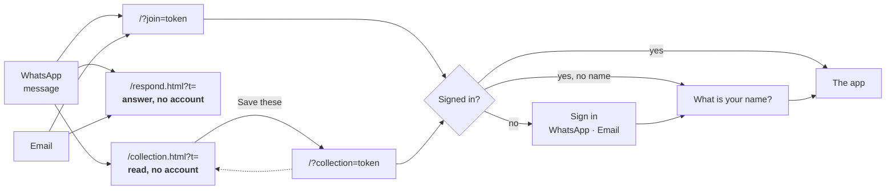
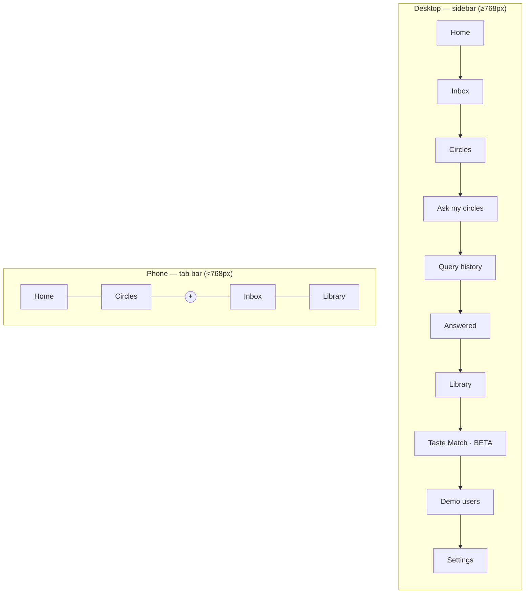
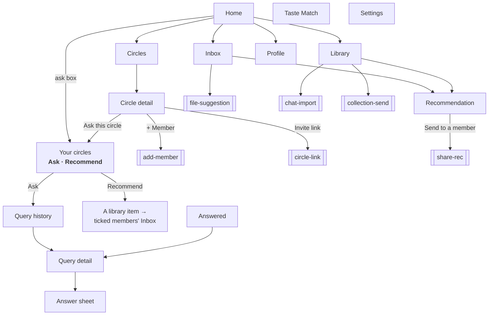
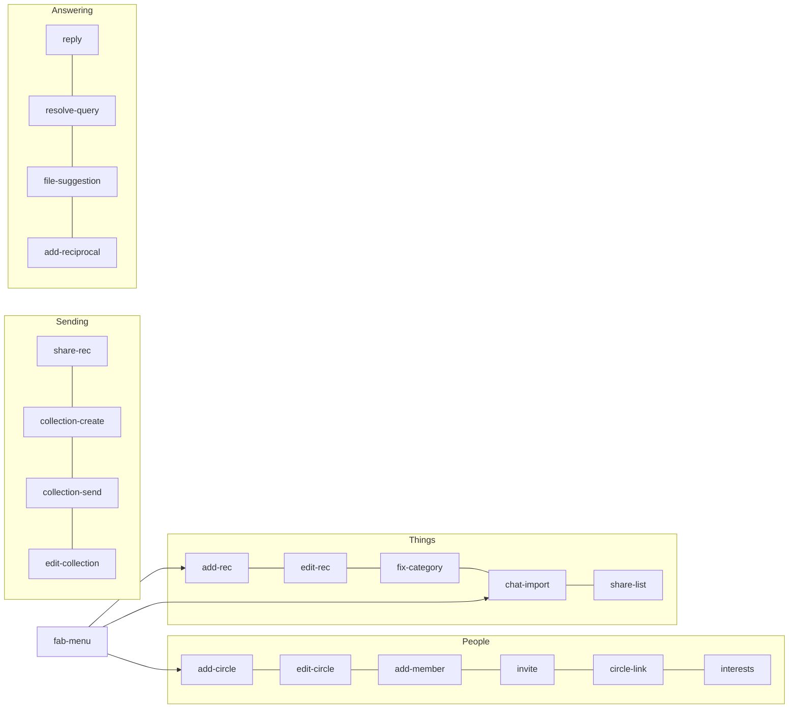
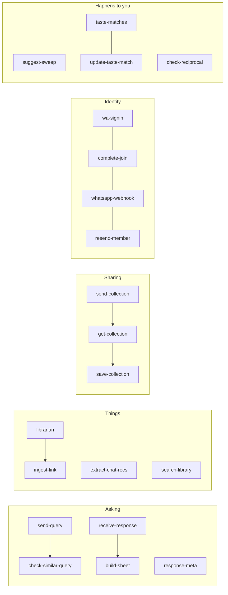

# Trustnet — Navigational Structure

Read from `web/index.html` on 12 Sep 2026 (v0.88.0), not from memory. Every view,
tab and modal below exists in the code; nothing here is aspirational. Section 5
was checked against the **live project**, not against the repo, and they differ.

Diagrams are Mermaid, so GitHub renders them and any Markdown viewer can export
them to PDF or an image.

---

## 1 · Entry points

The product is four static pages. Three of them are reachable **without an
account** — that is deliberate, and it is what lets a stranger answer a question
or read a list before deciding to join.

| URL | Account needed | What it is |
|---|---|---|
| `/` | yes, or an invite | The app |
| `/?join=<token>` | no, to arrive | A circle invitation |
| `/?collection=<token>` | to save | A shared list, being saved into your library |
| `/?claimed=<token>` | no | The WhatsApp fallback landing, if the tab was lost |
| `/respond.html?t=<token>` | **no** | Answer someone's question |
| `/collection.html?t=<token>` | **no** | Read a shared list |
| `/privacy.html` | no | Policy |

**The invited path never sees the sign-in form.** When a `?join=` token resolves,
the whole email/phone apparatus is hidden and one button remains — *Continue with
WhatsApp*. That is `showInviteBannerIfPending()`, and it is the only place the
form is hidden.

---

## 2 · The two navigations, and why they differ

There is no single menu. A phone and a desktop get different sets, and the
difference is not cosmetic — **four of the eleven destinations cannot be reached
from a phone at all.**

| Destination | Sidebar | Phone tab bar | Reachable on a phone by |
|---|---|---|---|
| Home | ✓ | ✓ | |
| Inbox | ✓ | ✓ | |
| Circles | ✓ | ✓ | |
| Library | ✓ | ✓ | |
| Ask my circles | ✓ | — | FAB, or *Ask this circle* on a circle |
| Recommend to a circle | — | — | the **Recommend** tab on that same screen |
| Query history | ✓ | — | **nothing** |
| Answered | ✓ | — | **nothing** |
| Taste Match | ✓ | — | **nothing** |
| Profile | avatar | — | a card at the foot of Home |
| Settings | ✓ | — | **nothing** |

> **This is the open question in the IA.** `#sidebar` is
> `display:none !important` under 768px. Four destinations have no phone route,
> and Profile only has one because a card was added to Home for that purpose
> (v0.70.0). Most of the beta is arriving on phones.

> **The screen and the menu disagree about its name** (v0.88.0). The sidebar
> item still reads *Ask my circles* and `VIEW_TITLES.query` still puts *Ask My
> Circles* in the topbar, while the screen itself is headed **Your circles**
> and carries two verbs. **Recommend has no door of its own.** Every route in
> — the sidebar, the FAB, *Ask this circle*, the Home ask box — is labelled
> *Ask*, and not one of them sets the verb; only the toggle writes
> `AppState.queryMode`. See `USER-FLOWS.md`, *Where a person can get stuck*.

---

## 3 · Views

Fourteen views, one router, one topbar that renames itself. `showView(name,
params)` is the only way to move. **v0.88.0 added no view** — it put a second
verb inside one, so the count is unchanged and the `query` view now does two
jobs.

Square-bracketed nodes are **modals**, not views: they do not change the topbar
and the back button does not return through them.

---

## 4 · Modals

Twenty. They are the app's verbs — every one of them changes something.
**v0.88.0 added none of them:** Recommend-to-a-circle is a tab inside the
`query` view, not a modal, and it shares `sendRecToMany` with the `share-rec`
dialog rather than reimplementing the send.

---

## 5 · What the client cannot do alone

**Twenty in the repo. Twenty-three live.** Worth having on the map, because
several **user-visible behaviours have no button** — they happen to you.

`suggest-sweep` runs every five minutes on a **pg_cron** job — not in the repo,
measured alive on 9 Sep with 8,328 dispatches. It is the only part of the product
with no entry point at all: things simply appear in your Inbox.

`send-query` takes `member_ids` as of v0.88.0, and **refuses them at degree 2**:
degree 2 means "and their contacts, anonymously", so a list of names cannot
describe who it reaches. A chosen list matching nobody in the circle is refused
rather than widened to the whole circle, which would be the worst available
failure. The client greys the tick list for the same reason; the function is the
half that cannot be bypassed.

### The v0.88.0 deploy landed

All twenty repo functions were redeployed in one sweep on **10 Sep 2026,
15:59:46 → 16:00:26 UTC** — twenty-eight seconds after the v0.88.0 commit
(15:59:18 UTC). So the server half of *choose who to ask* is live, not merely
pushed. Read from `supabase functions list`, not assumed.

### Three live functions have no source in this repo

Also read from the live project on 12 Sep 2026. All three are `ACTIVE`:

| Function | Version | Last deployed | Source in repo |
|---|---|---|---|
| `accept-invite` | 21 | 3 Jul 2026 | no |
| `public-list` | 21 | 3 Jul 2026 | no |
| `classify-rec` | 31 | 3 Aug 2026 | no — and the client says it was **deleted 4 Aug** |

Nothing in the repo calls any of the three, and `accept-invite` and
`public-list` still carry an entrypoint under an old `OneDrive/…` path — they
predate this working tree. `classify-rec` is the one to look at:
`web/index.html:5709` states it was deleted on 4 Aug, and it is still deployed
and callable. This is the same class of problem as the missing `0044` migration
named in `CLAUDE.md`: **live behaviour with no source under version control.**
