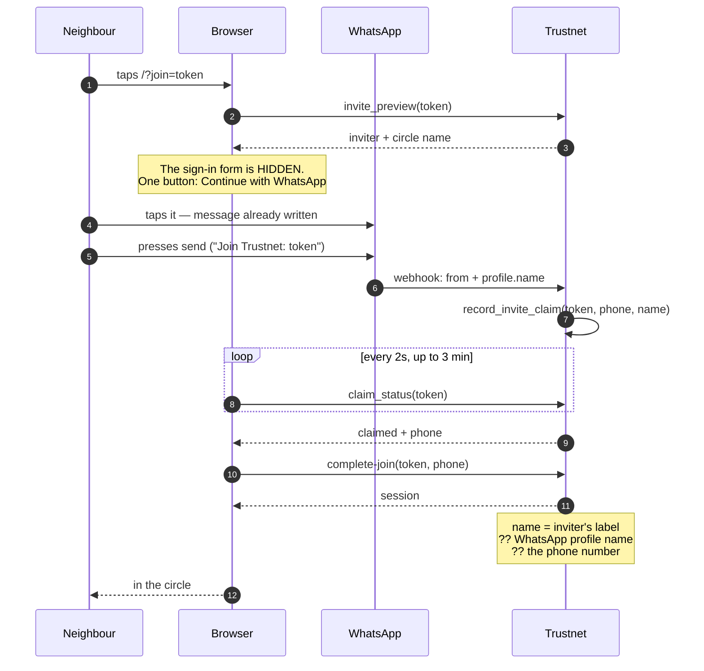
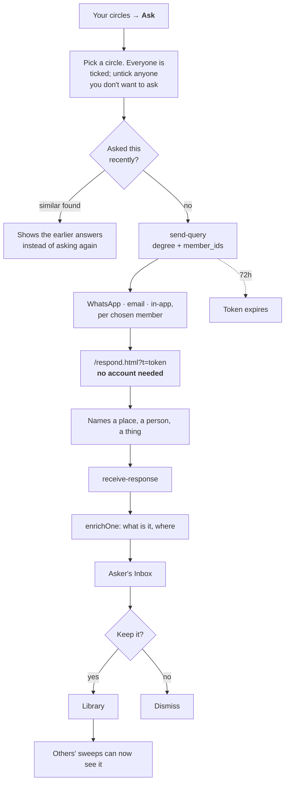
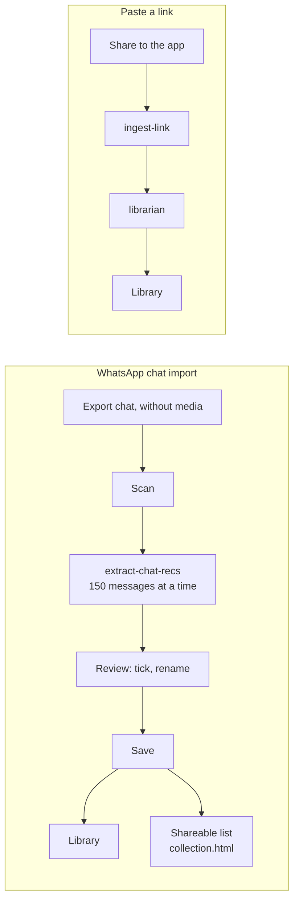
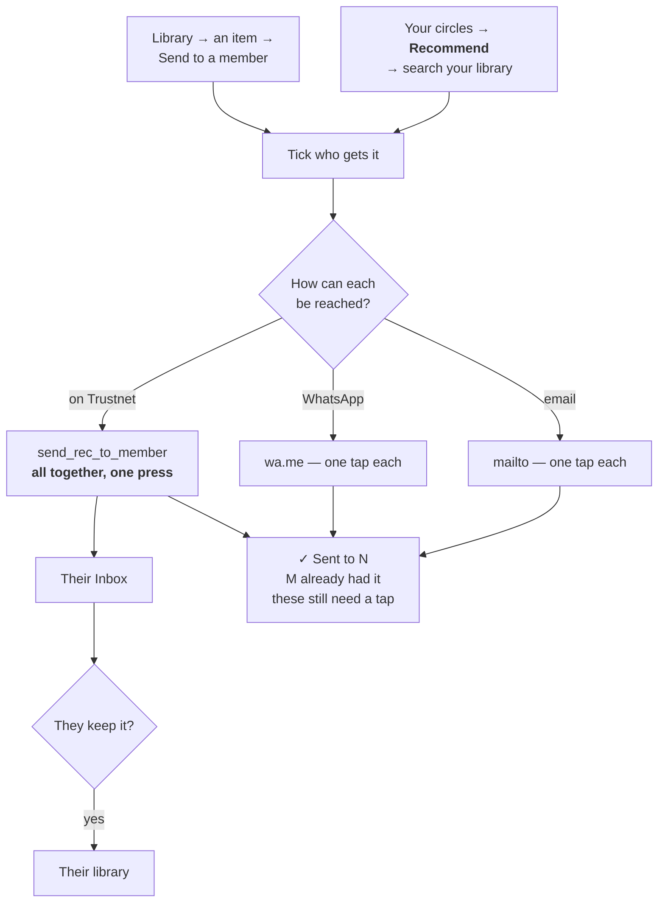
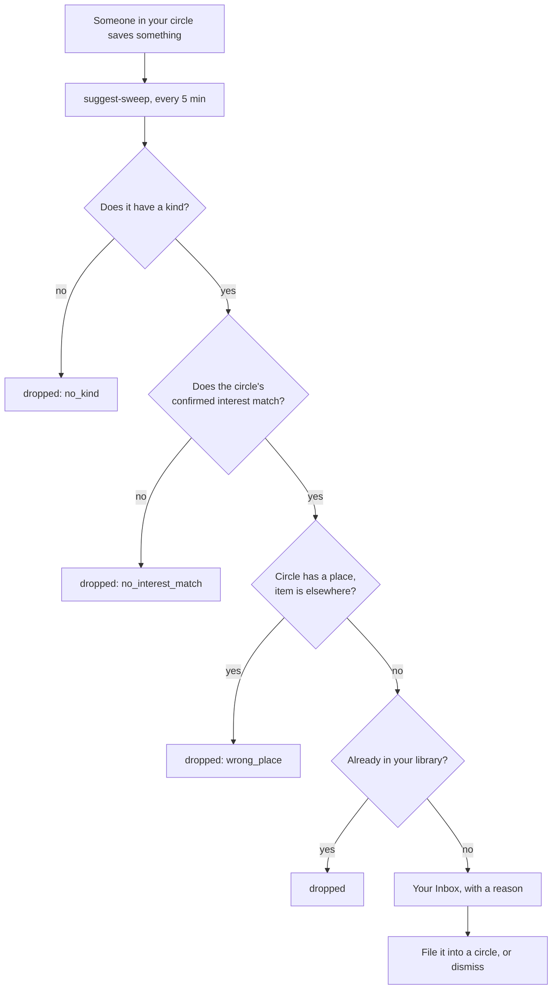
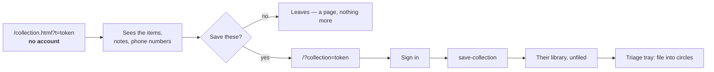

# Trustnet — User Flows

The paths a real person takes, read from the code on 12 Sep 2026 (v0.88.0).
Companion to `NAVIGATION.md`, which is the structure; this is the movement
through it.

Mermaid throughout, so GitHub renders it and any Markdown viewer exports it.

---

## The product in one line

**Ask people you trust. Keep what they answer. See what they saved.**
Since v0.88.0 the same screen also does the reverse — **pass something on** —
so a circle has two verbs rather than one. Everything else serves one of them.

---

## 1 · Joining — the flow most people meet first

A neighbour taps a link in WhatsApp. They should reach the app **having done
nothing but press send.**

**If the tab is lost** — iOS may discard it while WhatsApp is open — WhatsApp
replies with `/?claimed=<token>`, which signs them in on tap. That branch exists
because the tab really does get discarded.

**Only if no name could be found** does the app ask for one, and only for
accounts created after the v0.85.0 cutoff.

---

## 2 · The core loop — ask, answer, keep

The reason the product exists. Note that **the answerer never needs an account.**

Six things worth noticing:

- **`check-similar-query` can stop the ask** and show existing answers. Asking
  is not guaranteed to send anything.
- **The question travels with the answer** (`0047`): `source_question` is stored
  on the row, so a saved item remembers what it was answering.
- **The enricher works from the question.** "Good restaurant in Firenze?" →
  Florence, Italy. The question frames what the answer is.
- **Everyone starts ticked** (v0.88.0). The default is the whole circle, which
  is what the product did before the screen grew a choice — so unticking is the
  new gesture, not ticking. Someone with no contact details is shown but cannot
  be ticked: leaving them out entirely would look like they had left the circle.
  External sources never appear, because they cannot be messaged at all.
- **Degree 2 had never actually sent anything, until v0.88.0.** The toggle set a
  variable inside `initQueryView`'s closure and updated the routing preview;
  `handleSendQuery` posted `degree: 1` hard-coded and never read it. Every query
  since the toggle existed went one hop, whatever the screen showed. It reads
  `AppState.queryDegree` now.
- **Degree 2 and a list of names contradict each other.** Degree 2 means "and
  their contacts, anonymously" — people the sender cannot see or name — so the
  tick list is disabled there and says why, and `send-query` refuses
  `member_ids` at degree 2 where it cannot be bypassed.

---

## 3 · Filling a library without asking anyone

Two ways in, both without a single question being sent.

The import is the only flow that produces something **publicly readable** — a
collection page anyone can open, with the phone numbers on it. That is what
makes it the growth path, and what makes it the one to think about twice.

---

## 4 · Sending something to people

Two doors since v0.88.0, one send. *Library → an item → Send to a member* is the
old one and still there; *Your circles → Recommend* is the new one, and it
starts from the circle instead of from the thing.

**The asymmetry is real and cannot be designed away.** A browser hands off to
another app once per gesture, so WhatsApp and email recipients each need their
own tap. The result line says so rather than pretending.

**One implementation, not two.** `sendRecToMany` and `sendResultHtml` were
lifted out of `handleSendRecMulti` in v0.88.0, so both doors answer "who got
it" the same way. A delivered person is unticked on the spot in both, which is
what stops a second press double-sending.

---

## 5 · What happens to you without asking

The only flow with no entry point. Every five minutes, `suggest-sweep` looks at
what people in your circles have saved.

Every drop-out is counted and returned. That is how *"Agia Marina, a beach,
reached him through his ski circle"* was diagnosed: `no_interest_match` and
`wrong_place` are the two gates added on 25 Aug.

---

## 6 · Reading a list somebody sent

---

## Where a person can get stuck

Honest list, from the code and from this week's beta:

1. **Coming back on a different browser.** Joined inside WhatsApp's browser,
   later opens Safari — no session, and a WhatsApp-created account has no real
   email and no working OTP. The invite link is the only way back.
2. **Four destinations have no phone route** — Query history, Answered, Taste
   Match, Settings. See `NAVIGATION.md`.
3. **An item with no `kind`** is invisible to the sweep and to category learning.
   72 of 153 canonicals were in that state when counted on 9 Sep; the number is
   not re-measured here.
4. **The response token expires after 72 hours.** After that the answer link is
   dead and the asker sees nothing.
5. **The verb toggle throws away what you typed** (v0.88.0). Switching between
   *Ask* and *Recommend* calls `showView('query')`, which re-renders the whole
   screen. What survives that is not what a person would expect:

   | On the screen | Survives the toggle? | Why |
   |---|---|---|
   | The circle you chose | yes | kept deliberately on `AppState.queryCircleId` |
   | Degree 1 / 2 | yes | `AppState.queryDegree` |
   | The question you typed | **no** | `#q-text` is re-rendered empty |
   | Who you unticked | **no** | `qWhoHtml` renders everyone ticked again |
   | The item you picked | **in state, but not on screen** | see 6 |

   Type a question, tap *Recommend* to see what it is, tap *Ask* again — the
   question is gone.
6. **Recommend can send an item you cannot see.** `qShowPickedItem()` runs only
   when you pick or clear an item, never on render — but
   `handleSendRecFromCircle` reads `AppState.queryItemId`. Pick something, switch
   verb or leave the screen and come back: the chosen-item card is empty, the
   button still reads *Send to 3 people*, and pressing it sends the item that is
   no longer shown.
7. **Every door into the screen is labelled *Ask*, and none of them sets the
   verb.** The sidebar, the FAB's *Ask a question*, *Ask this circle* on a
   circle, and the Home ask box all call `showView('query')` without touching
   `AppState.queryMode`, which only the toggle ever writes. If the last thing
   you did there was recommend, all four land on **Recommend**. From the Home
   box it is worse: `handleHomeAsk` writes your draft into `#q-text`, which in
   that mode sits inside a `display:none` block — you get the Recommend form and
   your question nowhere on screen.
8. **The routing preview counts the whole circle; the button counts the ticks.**
   `updateRouting` reads `membersOfCircle` and ignores the checkboxes, so the
   grey panel can say *8 contacts* directly above a button reading *Ask 3
   people*.
